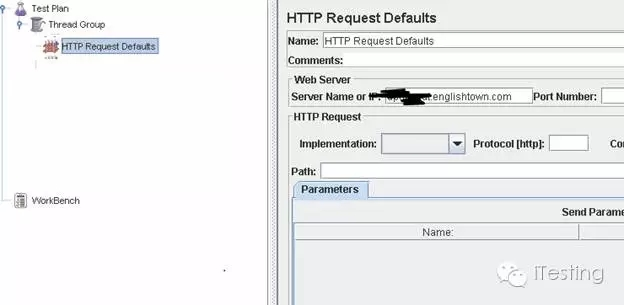
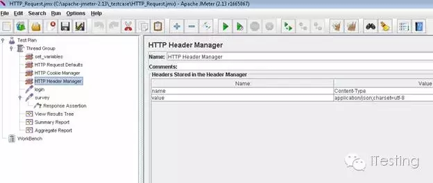
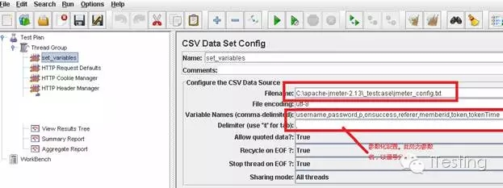
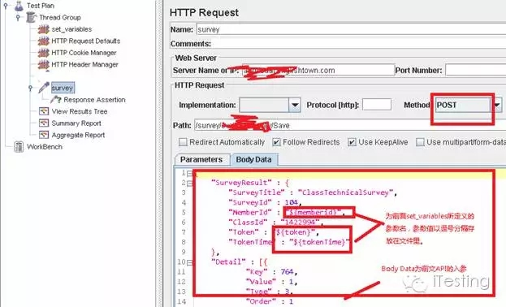
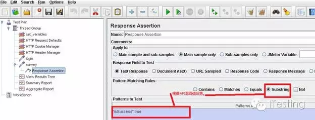
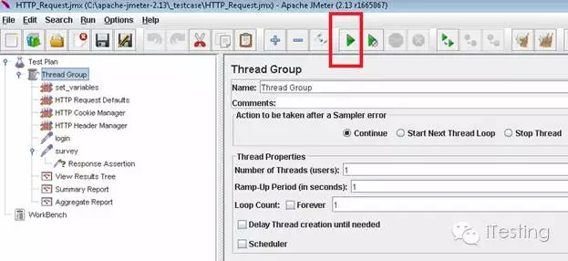
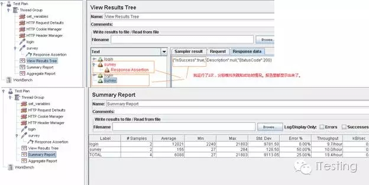

接口测试自动化框架实践指南
<!--more-->

对接口测试概念和好处还不甚理解的同学，请移步iTesting的历史文章《接口（API）测试》。
今天介绍的接口测试自动化框架组成如下：
Jmeter  + Ant + Jenkins。
我们分为两个部分介绍：
1.Jmeter的脚本生成及参数化
2. Ant + Jenkins集成
在详细框架搭建前，我们以一个Restful格式的API为例。这个API的是用做学生上完课后老师给学生的打分：

POST: /survey/evc/EVCSurvey/Save
UAT URL: http://**.englishtown.com/***/Survey/Save
Save Survey Result Request 
{
    "SurveyResult" : {
        "SurveyTitle" : "ClassTechnicalSurvey",
        "SurveyId" : 1000000,
        "MemberId" : 12345678,
        "ClassId" : "987654321",
        "Token" : "dd556a9d36c1984bbab94f37483f484f",
        "TokenTime" : "2016-04-24T08:56:32.8807460Z"
    },
    "Detail" : [{
            "Key" : 764, 
            "Value" : 1, 
            "Type" : 3, 
            "Order" : 1
        },{...}
   ]
}
Save   Survey Result Response 
{
    "IsSuccess" : true,
    "Description" : "",
    "StatusCode" : 200 //200->Success, 0->None, -300->Invalid Parameter,
 -400->Invalid Token, -500->Unhandled Exception
}


我们来看看如何测试这个接口：
1.       手工写test case（如入参的检查，返回值检查，数据库查询，invalid case等不再赘述）
2.       把test case转成一个个jmeter脚本。
3.       运行脚本，查看期望结果（例如返回值，数据库记录等）。
4.       用Ant生成build.xml文件，并成功运行并生成jtl和html格式报告。
5.       集成Ant到Jenkins, 配置自动运行并生成测试报告发送邮件等。
今天先介绍第一部分Jmeter的脚本生成及参数化：
我们拿正确输入入参，返回正确返回值为例，来介绍如何生成Jmeter脚本。
Jmeter安装好后，我们先添加需要用到的选项，按以下步骤添加：
1.       右键Test Plan，Add → ThreadGroup.
2.       右键ThreadGroup， Add → Config Element → HTTP Request Defaults.
设置 Server name or IP （*.englishtown.com）， port留空。

3.       右键ThreadGroup， Add → Config Element → HTTP Cookie Manager
4.       右键ThreadGroup， Add → Config Element → HTTP Header Manager并设置如下：

5.       然后右键ThreadGroup，分别
add->Listener-> Aggregate Report
add->Listener-> Aggregate ReportView Results in Tree
add->Listener-> Aggregate ReportSummary Report
关注iTesting，后续更精彩。
6.       然后右键ThreadGroup，add->Config Element->CSV Data Set Config， 重命名为set variable。并设置如下（这个txt文件里为参数化的值）：

7.       然后右键ThreadGroup，add->Sampler->HTTP Request，并重命名为suvery，根据前文API的描述，我们的post请求里配置如下（放在Body Data里），Jmeter参数化格式 ${}：

8.       然后右键suvery， add->Assertions->Response Assertions， 并根据API返回值设置assertion

9.       最终我们得到以下配置项并配置完毕如下图所示，点击Run运行。

10.   我们得到的结果如下。

11.    最后我们检查下数据库看看有没有写入就可以了。
以上是用jmeter生成脚本，如果不想通过GUI方式运行，也可以用命令行直接调用：格式如下：
-n This specifies JMeter is to run in non-gui mode
-t [name of JMX file that contains the Test Plan].
-l [name of JTL file to log sample results to].
-r Run all remote servers specified in JMeter.properties (or remote servers specified on command line by overriding properties)
The script  also lets you specify the optional firewall/proxy server information:
-H [proxy server hostname or ip address]
-P [proxy server port]
Example : JMeter -n -t my_test.jmx -l log.jtl -H my.proxy.server -P 8000
对于我们的例子如下：
C:\apache-jmeter-2.13\bin>jmeter -n -t C:\Users\kevin.cai\Desktop\HTTP_Request.j
mx -l log.jtl

到此jmeter脚本就生成了，文件后缀*.jmx。我们可以根据需求设计出更多的jmeter脚本以备后用。 明天我们讲如何集成Ant和Jenkins。