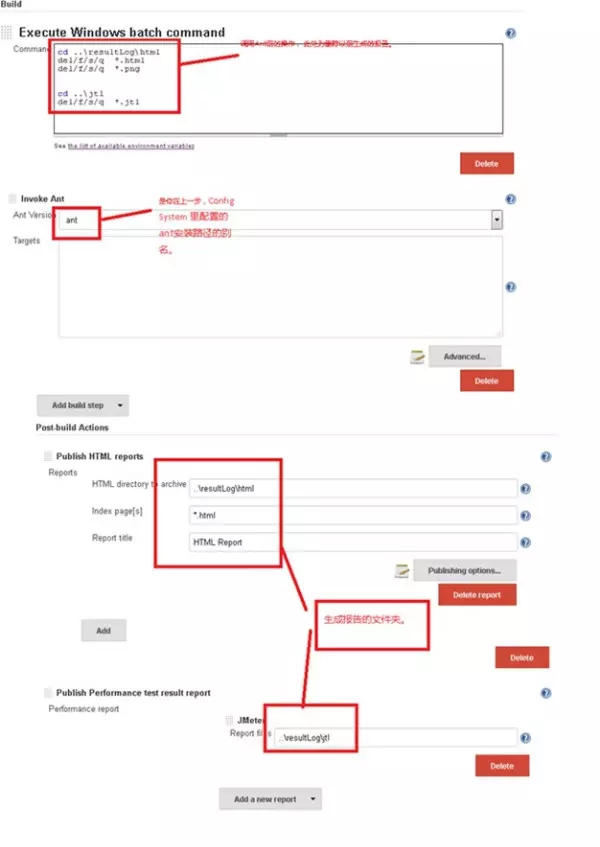
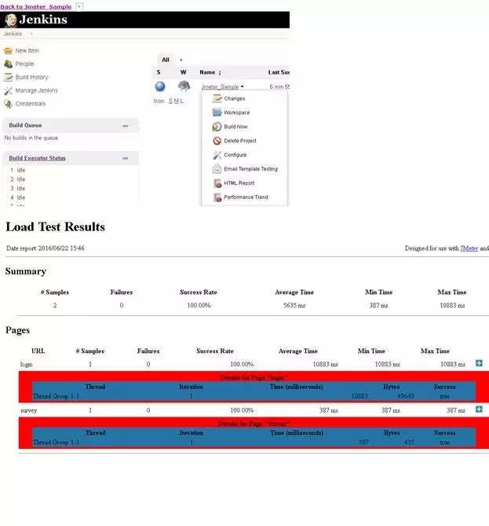

接口测试自动化框架实践指南（二）
<!--more-->

上次我们分享了接口自动化框架的第一部分Jmeter的脚本生成及参数化，今天我们来看第二部分：
Ant + Jenkins集成：
1.       通过ant一键执行一个或多个jmeter脚本，并批量生成html格式的报告。
2.       通过Jenkins自动化构建，完成测试框架搭建并生成测试报告。
在此之前我们需正确安装并配置如下软件：

验证java

>C:\>Java -version
java version "1.8.0_06"

验证ant

>C:\>ant -version
Apache Ant(TM) version 1.9.6 compiled on June 29 2015

使用Ant运行jmeter脚本。：
1、首先我们默认Jmeter脚本已经录制好了，并测试通过，存在（查询模块.jmx）脚本
2、为了能够在ant中使用jmeter task，必须将“ant-jmeter-1.1.1.jar”这个jar包放到ant的classpath中去。这个jar包位置 jmeter的安装目录下的 extras 目录中。
也可直接将这个jar拷贝至ant安装目录下的lib目录中。这样Ant运行时才能找到"org.programmerplanet.ant.taskdefs.jmeter.JMeterTask"这个类，从而成功触发JMeter脚本 。    
3、jmeter默认保存的是.csv格式的文件，所以我们先要设置一下bin/jmeter.properties文件内容，保存    jmeter.save.saveservice.output_format=xml
4、使用Ant运行所有的*.jmx脚本，生成.jtl文件放入 ..\resultLog\jtl文件中，ant再将相应的文件转换为对应的html文件放入..\resultLog\html中.

build.xml文件中的内容如下：


<?xml version="1.0" encoding="UTF-8"?>
<project name="ant-jmeter-test" default="run" basedir=".">
    <tstamp>
        <format property="time" pattern="yyyyMMddhhmm" />
    </tstamp>
    <!-- 需要改成自己本地的 Jmeter 目录-->  
    <property name="jmeter.home" value=".." />
    <!-- jmeter生成jtl格式的结果报告的路径--> 
    <property name="jmeter.result.jtl.dir" value="..\resultLog\jtl" />
    <!-- jmeter生成html格式的结果报告的路径-->
    <property name="jmeter.result.html.dir" value="..\resultLog\html" />
    <!-- 生成的报告的前缀-->  
    <property name="ReportName" value="TestReport" />
    <property name="jmeter.result.jtlName" value="${jmeter.result.jtl.dir}/${ReportName}${time}.jtl" />
    <property name="jmeter.result.htmlName" value="${jmeter.result.html.dir}/${ReportName}${time}.html" />

    <target name="run">
        <antcall target="test" />
        <antcall target="report" />
    </target>
    <target name="test">
        <taskdef name="jmeter" classname="org.programmerplanet.ant.taskdefs.jmeter.JMeterTask" />
        <jmeter jmeterhome="${jmeter.home}" resultlog="${jmeter.result.jtlName}">
            <!-- 声明要运行的脚本"*.jmx"指包含此目录下的所有jmeter脚本-->
            <testplans dir="." includes="*.jmx" />
            <property name="jmeter.save.saveservice.output_format" value="xml"/>
        </jmeter>
    </target>
    <path id="xslt.classpath">
        <fileset dir="${jmeter.home}/lib" includes="xalan*.jar"/>
        <fileset dir="${jmeter.home}/lib" includes="serializer*.jar"/>
    </path>

    <target name="report">
        <tstamp> <format property="report.datestamp" pattern="yyyy/MM/dd HH:mm" /></tstamp>
        <xslt 
              classpathref="xslt.classpath"
              force="true"
              in="${jmeter.result.jtlName}"
              out="${jmeter.result.htmlName}"
              style="${jmeter.home}/extras/jmeter-results-detail-report_21.xsl">
              <param name="dateReport" expression="${report.datestamp}"/>
       </xslt>

                <!-- 因为上面生成报告的时候，不会将相关的图片也一起拷贝至目标目录，所以，需要手动拷贝 --> 
        <copy todir="${jmeter.result.html.dir}">
            <fileset dir="${jmeter.home}/extras">
                <include name="collapse.png" />
                <include name="expand.png" />
            </fileset>
        </copy>
    </target>

</project>



切换目录到build.xml所在文件夹，运行ant查看结果是否生成（*.jtl 和*.html）。

集成Jenkins。
1.       Jinkeins安装好后，需要添加如下插件：Performance plugin 、 HTML Publisher plugin  、ant  Git, Email Extension Plugin 插件。
2.       在Manage Jenkins –>Config System 里，配置JDK， Ant安装路径。
3.       新建一个freestyle project，配置Source Code Management（一般选用Git）， Build Triggers（何时触发build运行）， 然后build下配置Execute shell，Ant， 然后在Post Build Actions下面配置Publish HTML Reports 和 Publish Performance Test Results Report， 如下图：

配置好后Jenkins会根据你前文设置的Trigger自动download代码执行。结果如下：

到此为止我们的接口测试框架就搭建完成了， 怎么样是不很简单?

以上只是iTesting的一个简单接口测试框架，实际应用中，框架还有以下可以优化的地方：
1.Jmeter脚本的编写，参数化，及断言调用数据库，前一个post的返回结果是后一个post的入参（这个时候如何传递value）等。
2.Build.xml文件编写。这个决定了那些jmx file会运行，报告如何生成。
3.Jenkins配置，关键是HTML report和Performance report的配置。
