纯flask实现的一个blog。

<!--more-->

网站的整体效果：
登录页面（也是首页）：
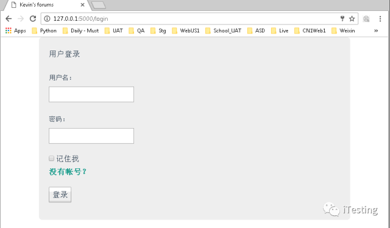

注册页面:

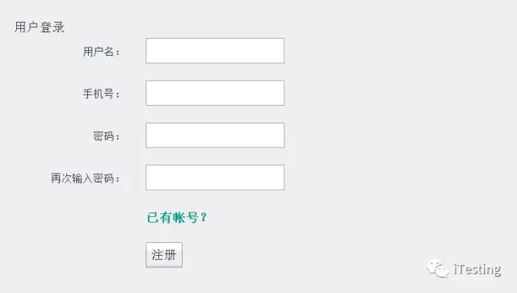

这两个页面都实现了基本的验证，比如：
用户名密码为空

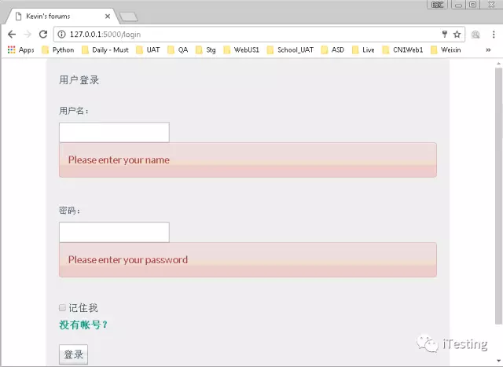

密码不正确：

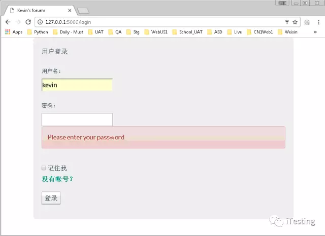

正确登录后会跳转到系统主页面，长下面的样子：

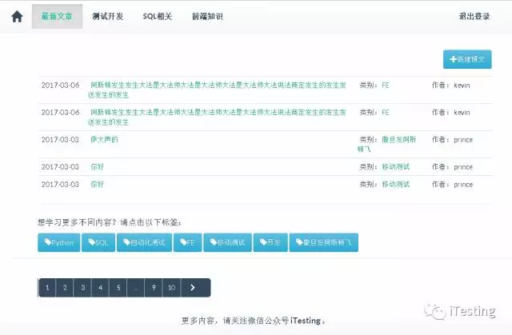

页面模块：
- Header
- Footer
- 文章模块
点击主页上的模块，或者在任何文章的类别上点击，会进入下面的两个页面：
一个是列在Header上的类别，类别选中会高亮。：

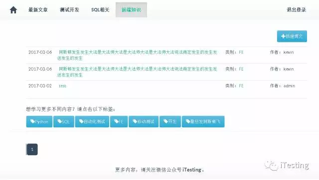

一个是未列在Header上的类别，无高亮：

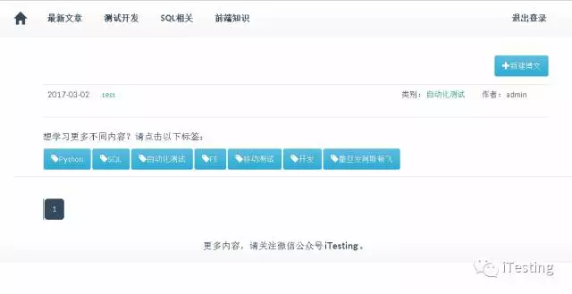

- 文章分类tag

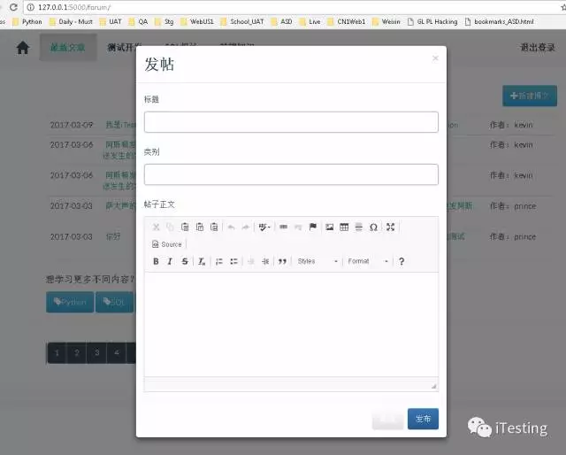

- 分页模块

参考了Flask上的分页，加上用了Bootstrap的样式

- 新建/修改/删除 文章模块。

用了CK Editor，最好的编辑器之一。

新建：

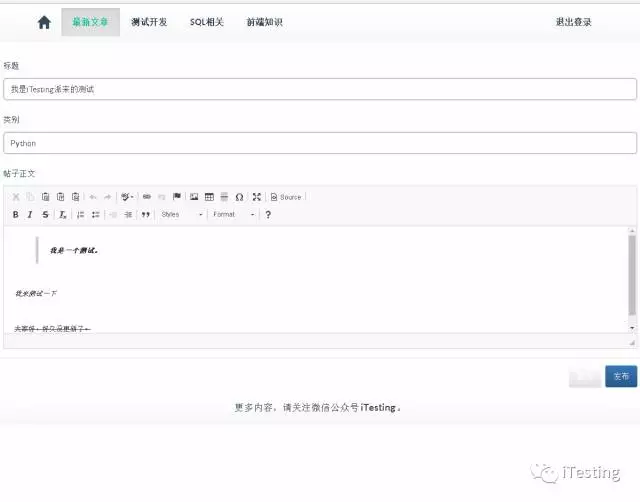 

修改：

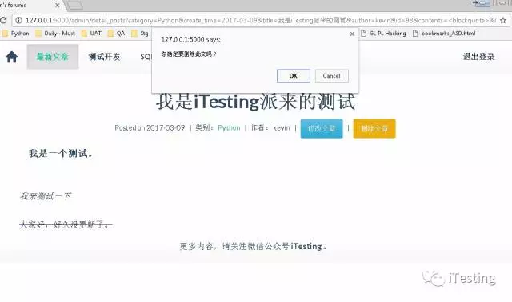 

删除：

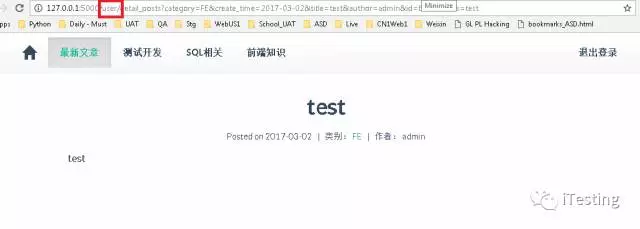 

- 文章详页模块

一个是对文章只有浏览权限，没有修改和删除按钮：

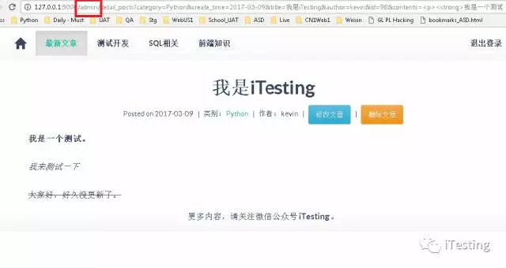

一个是文章的作者或者Admin用户组的用户，对文章有full control权限

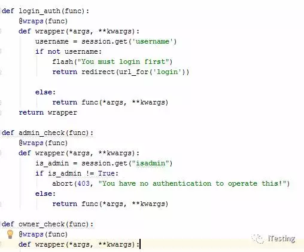 

- 权限控制模块（包括用户，权限，登录验证，管理员验证等）

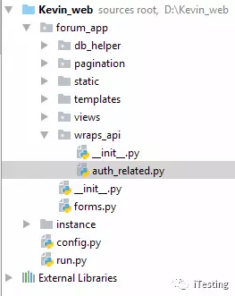 

- 项目配置（使用instance）

