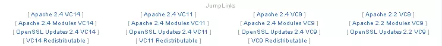
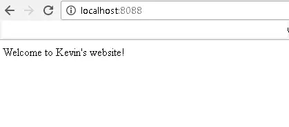

当你开发好一个网页程序后，除了本地浏览，你当然期望把它发布出去供大家欣赏。我们今天就来讲下如何用Apache 部署你的应用程序（注：发布后只能通过ip访问，你需注册域名才能通过域名访问）。

<!--more-->

重要的事情说三遍：
for i in range（3）:
"以下所有的安装要么全部安装32bit，要么全部安装64bit，否则运行不起来。"

1.安装 Python
唯一注意的是安装选项需选择应用于所有用户。

2.安装Apache:
地址：https://httpd.apache.org/download.cgi 
以window为例，我们选择Files for Microsoft Windows， 然后安装Apache Haus下所有的相应版本，例如：

注意看, 竖排的软件为兼容的组合，如果你安装vc11，那么vc11这一列的都要安装，安装好后根据文件里的 readme进行配置，其中要注意的是主要是mod_wsgi 的安装，这个是用来和python通信的。

注意：
× 根据需要配置你的SRVROOT文件路径（apache安装文件conf下的httpd.conf），这里为"C:\Apache24".
× 根据需要更改你的端口号。（可以在command line下用netstat -ao的方式看端口号有没有被占用。）
× 注意需成功配置mod_wsgi, 提示：
在apache安装目录下 启用 LoadModule wsgi_module modules/mod_wsgi.so 并将mod_wsgi 文件copy到modules目录。

全部安装好后，command line进入apache的bin目录，输入httpd来看安装是否正确，然后输入httpd -k install 来安装windows service，然后启动。

3.安装flask
pip install Flask 

4.开发你的app
我们写一个welcome页面，需要2个文件：
main.py

from flask import Flask
app = Flask(__name__)
@app.route('/')
def hello_world():
   return "Welcome to Kevin's website!"
if __name__ == '__main__':
   app.run()


main.wsgi （这个文件用做网关跟apache通信，记住文件名称，apache配置要用）

To run your application you need a yourapplication.wsgi file. This file contains the codemod_wsgi is executing on startup to get the application object. The object calledapplication in that file is then used as application.


import sys, os
sys.path.insert(0, os.path.dirname(__file__))
from main import app as application


5.配置 Apache。

在httpd.conf里，配置如下：
* 去掉前面的#号。
Include conf/extra/httpd-vhosts.conf
* 在conf的extra下，配置httpd-vhosts.conf 如下：

<VirtualHost *:8088>
DocumentRoot	D:\wechat_test\wechat
ServerName	localhost
WSGIScriptAlias / D:\wechat_test\wechat\main.wsgi
<Directory D:\wechat_test>
Require all granted
</Directory>
</VirtualHost>

注意：
* 端口号跟httpd.conf的Listen端口一致。
* wsgi目录， Directory跟你app里定义的一致。
* 把文件里原有的不需要的配置command out掉。

6.重启下Apache services，然后浏览器里输入http://localhost:8088看你开发的app首页有没有正确load：

成功，下面你可以继续完善你的app了 ：）