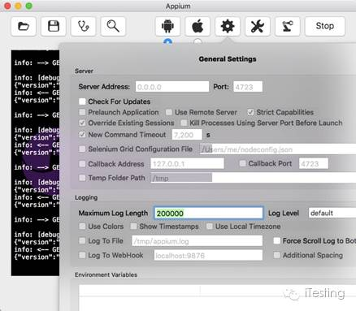
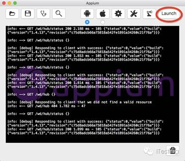
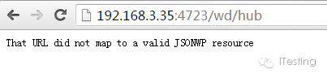
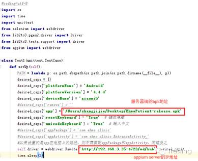

前面我分享过移动端测试<移动APP自动化测试之元素定位>, 但没有像web端测试那样系统，例如框架一笔带过，分布式运行甚至都没有提。近期有读者问我一个问题，如何实现Appium在远程运行自动化脚本？ 我建议他自己研究下，此文即为他的研究成果，分享给大家， 以下是正文：

<!--more-->

Appium的远程设置
客户端控制脚本，服务器控制手机和appium server（注：最终脚本运行在这个机器上）。
1. 客户端（PC1）配置IP地址要同服务器（appium server）在一个网段内。
2. 服务端设置地址和端口号，设置Server Address为0.0.0.0，Port为4723。

（注：服务器端实际IP为192.168.3.35）
3. 开启appium server服务

4. 在客户端（PC1）上验证能不能访问appium server
在浏览器上输入服务器的地址：（如下图所示）

5. 在客户端（PC1）中，修改脚本

6. 手机设备插在服务器mac上
7. 在客户端（PC1）中，执行脚本

如果在appium server（MAC机器上）能跑自动化，证明远程设置成功啦！

-------我是分割线----------
总结起来就一句话，webdriver.Remote（）这个方法控制脚本运行在哪个机器上，你想要脚本运行在哪台机器上，就在你的远程脚本里配置这个ip，并在被运行脚本的这台机器上的Appium server上，配置server地址为127.0.1或0.0.0.0。
