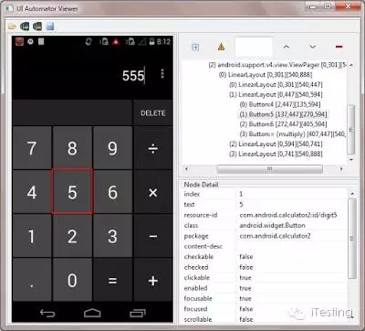
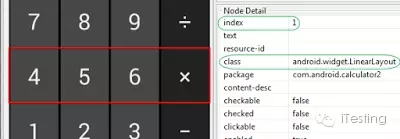
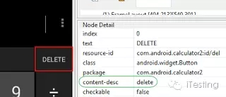
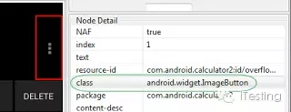
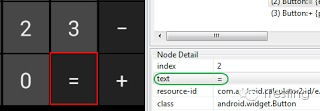
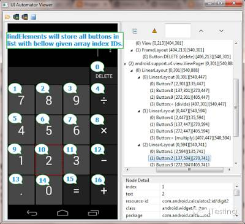
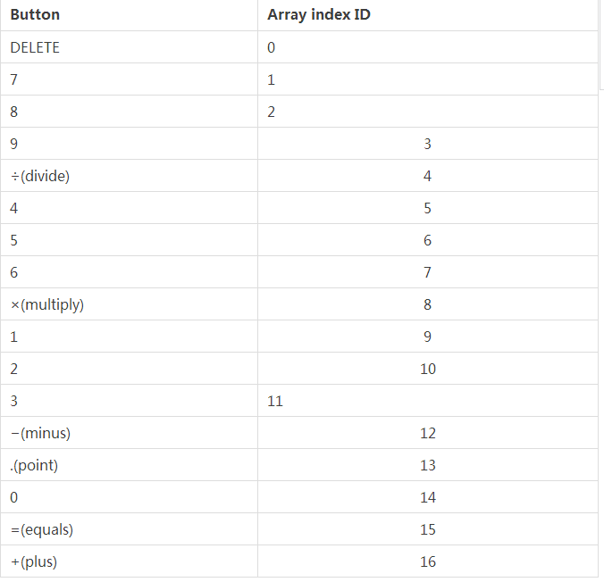

如何用UIAutomation Viewer定位Android APP元素
<!--more-->

We will use android calculator app to get element's XPath in different ways. Supposing I need XPath of button 5. So i can write XPath in multiple ways for it as bellow.
UI Automator Viewer screenshot for button 5 is as bellow. 

1. XPath using class and text attribute : 
In above image you can see that button 5 has text attribute with value = 5 which is unique. Class name is android.widget.Button which is same for all number buttons. So we can create XPath using text attribute value with class name as bellow.

xpath("//android.widget.Button[@text='5']")


2. XPath using class and resource-id : 
Here resource-id for button 5 is com.android.calculator2:id/digit5. Trailing part (e.g digit5, digit4, digit7) of resource-id is changing for every number buttons so we can use contains function to get relative XPath of button 5 as bellow.

xpath("//android.widget.Button[contains(@resource-id,'digit5')]")

3. XPath using class, text attribute and resource-id :
We can use combination of text attribute and resource-id with class name to create unique XPath of element button 5 as bellow.

xpath("//android.widget.Button[contains(@resource-id,'digit5') and @text='5']")

4. XPath using class, text attribute and index :
We can use same approach as described in point 3 but with index number. Button 5 has index 1 but it is not unique as number buttons 0,2 and 8 has also same index with same class name. So we can include text attribute with indexattribute to locate number button 5.

xpath("//android.widget.Button[@text='5' and @index='1']")

5. XPath using parent and child class hierarchy

As you can see in above image, Parent class android.widget.LinearLayout class with index = 1 has buttons 4, 5, 6 and X. So we can locate that specific row by it's class index. Child element is member of class android.widget.Button withindex = 1. So we can format XPath using parent and child class hierarchy as bellow.

xpath("//android.widget.LinearLayout[@index='1']/android.widget.Button[@index='1']")

6. XPath using content-desc

Supposing element has content-desc which is unique then you can use it to create XPath. Example : DELETE button has unique content-desc = delete. So we can write XPath for delete button using it as bellow.

xpath("//android.widget.Button[@content-desc='delete']")

7. XPath using class name
Note : Using class name In By.className or By.xpath will works only if it is unique for element. If same class name is provided to multiple elements then it will not work.

If software application's element has a class name and it is unique for element then you can use class name only to create XPath. See above image. Options button has class name android.widget.ImageButton which is unique. So we can use it only to create xpath as bellow.

xpath("//android.widget.ImageButton")

Locating Android App Element By ID
We can locate elements by ID in android app too. We can use resource-id as a id. Example is as bellow.
resource-id for button 5 is "com.android.calculator2:id/digit5" so we can locate to it by id as bellow.

id("com.android.calculator2:id/digit5")

Locating Android App Element By className
Same way, We can use class name to locate element if it is unique.

Class name for above option button is "android.widget.ImageButton". We can locate it using className as bellow.

By.className("android.widget.ImageButton")

Locating Android App element by Name
It is possible to locate element by name if element contains unique text.

If you see in above image, button Equals has text value "=". So we can locate it by name using bellow given syntax.

By.name("=")

Locating element by findElements
If you inspect all buttons of android calculator app, All the buttons has same class "android.widget.Button". If you know, findElements method is useful to get list of all the matching elements from current page as per given element locator mechanism. VIEW MORE DETAIL on findElements. So here we can collect list of all buttons using findElements and store list using java
List interface. Then we access required element using get() method of List interface.
Array list Index IDs of button elements of "android.widget.Button" class is as bellow.

List<WebElement> calcButtons = driver.findElements(By.xpath("//android.widget.Button"));
Above given syntax will store list of all buttons in list calcButtons with bellow given array list index ids. Bellow given table illustrate array index ids for different buttons of calculator application.
