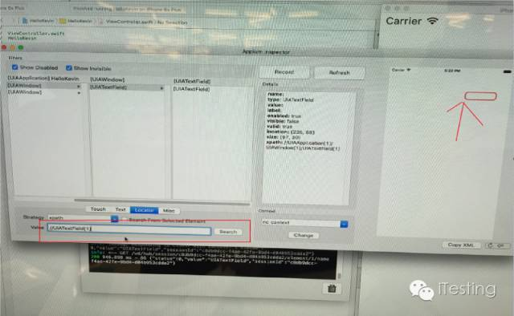

iOS自动化测试之元素定位
<!--more-->

在iOS自动化测试过程中， 如何来定位页面元素呢？
1. 利用Appium的Inspector
第一步，配置好你要运行的app的各项参数，如下图所示：

app path指向源代码编译后生成的 *.app文件
然后点击Launch（1）打开APP， 然后点击Inspector Icon（2）来load Inspector。

第二步，Inspector打开后如下图所示：

最右边是我们的APP HelloKevin， 目前只有一个TextEdit dialog。 左边红色部分是我们可以选择的locator。

第三步， 定位元素。
 写好能唯一指定页面元素的locator，然后点击右边的search， 如果定位正确，就会如下图所所示：

对应的代码（以Python为例）：


from page_objects import PageElement
........
TEXT_EDIT_XPATH = "//UIATextField[1]"
text_edit_dialog = PageElement(xpath=TEXT_EDIT_XPATH)   
self.driver.text_edit_dialog.click()

另外几种Locator Type 举例：

el = self.driver.find_element_by_id('ButtonsExplain')
el = self.driver.find_element_by_name('TextFields, Uses of UITextField')
el = self.driver.find_element_by_class_name('UIATextField')

2. 利用UI AUTomation
This allows elements in iOS applications to be found using recursive element search using the UIAutomation library.
Adds the methods driver.find_element_by_ios_uiautomation and driver.find_elements_by_ios_uiautomation.

el = self.driver.find_element_by_ios_uiautomation('.elements()[0]')
self.assertEqual('UICatalog', el.get_attribute('name'))
els = self.driver.find_elements_by_ios_uiautomation('.elements()')
self.assertIsInstance(els, list)

代码实现如下：

def find_elements_by_ios_uiautomation(self, uia_string):
    """Finds elements by uiautomation in iOS.

    :Args:
     - uia_string - The element name in the iOS UIAutomation library

    :Usage:
        driver.find_elements_by_ios_uiautomation('.elements()[1].cells()[2]')
    """
    return self.find_elements(by=By.IOS_UIAUTOMATION, value=uia_string)
    
def find_element(self, by=By.ID, value=None):
    """
    'Private' method used by the find_element_by_* methods.

    :Usage:
        Use the corresponding find_element_by_* instead of this.

    :rtype: WebElement
    """
    if not By.is_valid(by) or not isinstance(value, str):
        raise InvalidSelectorException("Invalid locator values passed in")
    if self.w3c:
        if by == By.ID:
            by = By.CSS_SELECTOR
            value = '[id="%s"]' % value
        elif by == By.TAG_NAME:
            by = By.CSS_SELECTOR
        elif by == By.CLASS_NAME:
            by = By.CSS_SELECTOR
            value = ".%s" % value
        elif by == By.NAME:
            by = By.CSS_SELECTOR
            value = '[name="%s"]' % value
    return self.execute(Command.FIND_ELEMENT,
                         {'using': by, 'value': value})['value']
